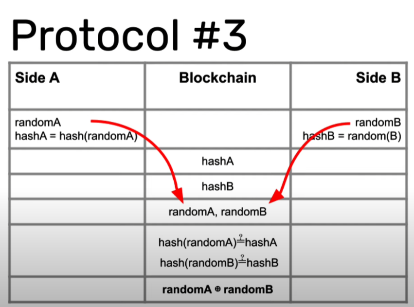

# road_to_web3_week8

How to build a random number generator for the blockchain

https://blog.logrocket.com/build-random-number-generator-blockchain/

https://www.youtube.com/watch?v=TL5NoWky3Uk

- [x] Why do we need rollups on Ethereum?
- [x] How an optimismtic rollup works and compares to zero-knowledge rollups
- [x] How to build a sample application: a betting game
- [x] How to deploy to Optimism testnet AND mainnet
- [X] Challenges and questions to consider!

## Notes

### First contract deployed on Optimism-goerli

0x16b1F19213FC922A67d3C50D32D9949080E4500E
https://blockscout.com/optimism/goerli/address/0x16b1F19213FC922A67d3C50D32D9949080E4500E

### Second contract implementing protocol 3

Contract Name:  CasinoRoyal

Contract deployed to: 0x22EE2A922d70c45dE8de9145176Ca212fBBb18f5

https://blockscout.com/optimism/goerli/address/0x22EE2A922d70c45dE8de9145176Ca212fBBb18f5

